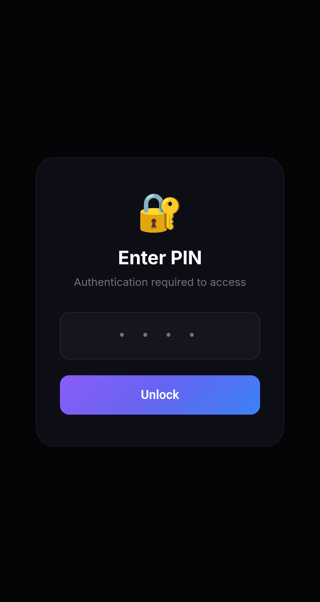
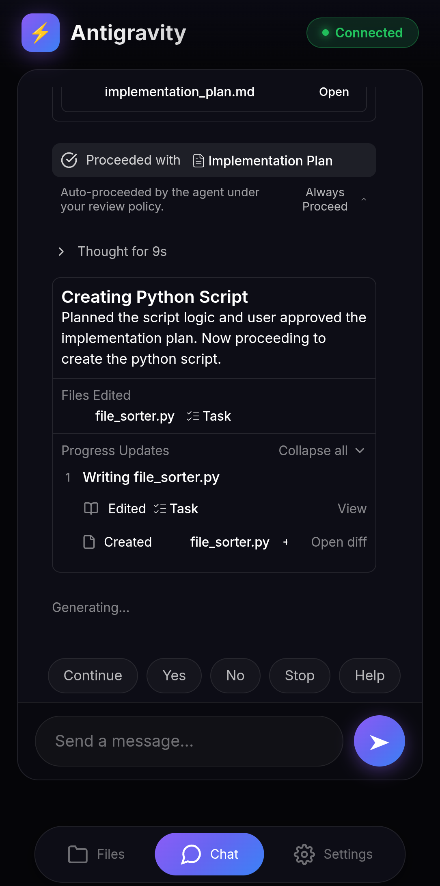
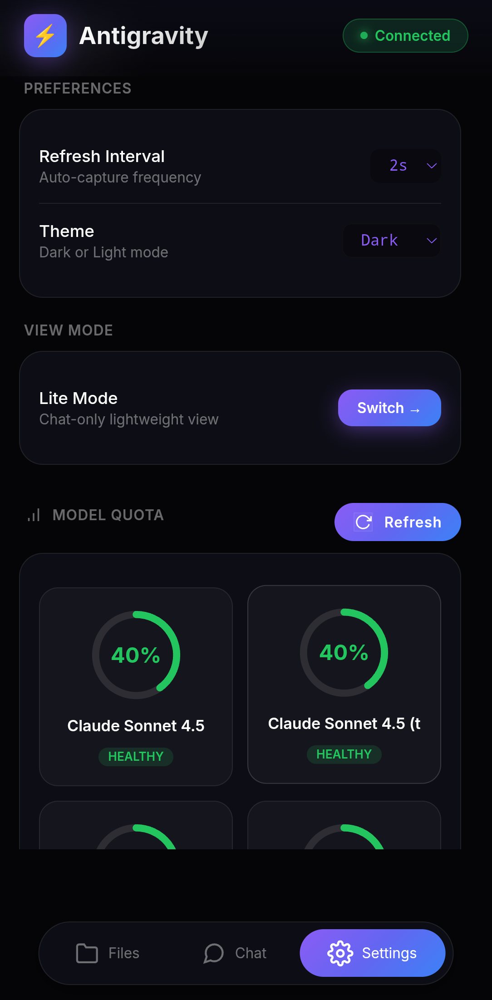

# Antigravity Mobile 📱

A mobile-friendly dashboard for [Antigravity IDE](https://antigravity.dev/) that lets you monitor your AI conversations and model quotas from any device.

<p align="center">
  
  
  
</p>

## ✨ Features

- **📊 Live Chat Streaming** - Watch your Antigravity conversations in real-time from any device
- **🎯 Model Quota Monitor** - View remaining quota for all AI models with visual progress indicators *(Windows only)*
- **📱 Mobile-First UI** - Beautiful, responsive interface designed for phones and tablets
- **🌓 Dark/Light Themes** - Easy on the eyes, day or night
- **🔄 Auto-Updates** - Conversations sync automatically without refreshing

## 🚀 Quick Start

### Prerequisites

- **Windows 10/11, macOS, or Linux**
- **Antigravity IDE** installed (the script will launch it automatically)
- **Node.js 18+** (Windows script will offer to install automatically)

> **Note:** Model Quota Monitor currently only works on Windows. Other features work on all platforms.

### Installation

1. **Download** or clone this repository:
   ```bash
   git clone https://github.com/yourusername/antigravity-mobile.git
   cd antigravity-mobile
   ```

2. **Run the start script**:
   - **Windows**: Double-click `Start-Antigravity-Mobile.bat`
   - **macOS/Linux**: Run `./Start-Antigravity-Mobile.sh`

3. **Open in browser**: Navigate to `http://localhost:3001`

4. **Access from phone**: Use `http://YOUR_PC_IP:3001` on the same network

That's it! The script will automatically install dependencies on first run.

## 📖 How It Works

```
┌─────────────────────────────────────────────────────────────┐
│                    Your Computer                             │
├─────────────────────────────────────────────────────────────┤
│  ┌────────────────┐         ┌─────────────────────────┐     │
│  │ Antigravity    │◄───────►│  Antigravity Mobile      │     │
│  │ IDE            │  API    │  Server (:3001)          │     │
│  │                │         │                          │     │
│  │ - Chat View    │  CDP    │  - Live Chat Stream      │     │
│  │ - Language     │◄───────►│  - Quota Monitor         │     │
│  │   Server       │         │  - Screen Capture        │     │
│  └────────────────┘         └─────────────────────────┘     │
│                                       ▲                      │
│                                       │ WebSocket            │
│                                       ▼                      │
│                             ┌─────────────────┐              │
│                             │  Your Phone 📱  │              │
│                             │  or Tablet      │              │
│                             └─────────────────┘              │
└─────────────────────────────────────────────────────────────┘
```

### Components

| Feature | How It Works |
|---------|--------------|
| **Live Chat** | Reads conversation data from Antigravity's chat stream API |
| **Quota Monitor** | Queries the language server's `GetUserStatus` endpoint (Windows only) |

## 🛠️ Configuration

The server runs on port **3001** by default. To change this, edit `launcher.mjs`:

```javascript
const PORT = 3001; // Change to your preferred port
```

### CDP Screen Capture

For screen capture to work, Antigravity must be launched with remote debugging enabled. The start script does this automatically, but if you start Antigravity manually, add this flag:

```bash
antigravity --remote-debugging-port=9222
```

## 📁 Project Structure

```
antigravity-mobile/
├── public/
│   └── index.html        # Mobile UI (single-page app)
├── http-server.mjs       # Express server with API endpoints
├── launcher.mjs          # Starts Antigravity + server together
├── quota-service.mjs     # Fetches quota from language server
├── chat-stream.mjs       # Live chat streaming service
├── cdp-client.mjs        # Chrome DevTools Protocol client
├── Start-Antigravity-Mobile.bat   # Windows launcher
├── Start-Antigravity-Mobile.sh    # macOS/Linux launcher
└── Stop-Antigravity-Mobile.bat    # Stop the server (Windows)
```

## 🔒 Privacy & Security

- **Local Only** - All communication stays on your local machine/network
- **No Cloud** - No data is sent to external servers
- **No Credentials Stored** - Uses Antigravity's existing authentication

## ❓ Troubleshooting

### "CDP Disconnected"
- Make sure Antigravity was started via the start script (not manually)
- Or add `--remote-debugging-port=9222` to Antigravity's shortcut

### "Quota not loading"
- Ensure Antigravity IDE is running
- Make sure you're logged in to Antigravity

### "Can't connect from phone"
- Check that your phone is on the same WiFi network
- Try using your PC's IP address instead of `localhost`
- Make sure firewall allows port 3001

## 🤝 Contributing

Contributions are welcome! Please feel free to submit a Pull Request.

## 📄 License

MIT License - see [LICENSE](LICENSE) for details.

## 🙏 Acknowledgments

- Inspired by [Antigravity-Shit-Chat](https://github.com/gherghett/Antigravity-Shit-Chat) by gherghett
- Built for use with [Antigravity IDE](https://antigravity.dev/)
- Quota monitoring inspired by the Antigravity Cockpit